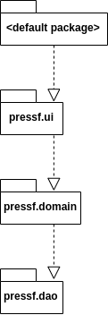
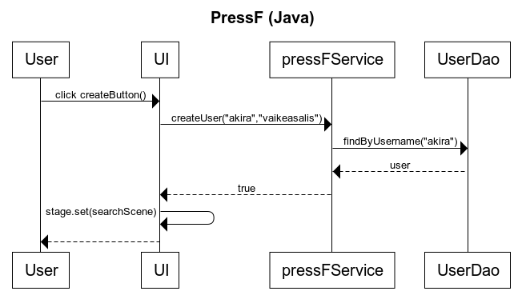

# Arkkitehtuurikuvaus

## Rakenne
Ohjelman rakenne tulee noudattamaan kolmitasoista kerrosarkkitehtuuria(DAO vielä lisää), ja koodin pakkausrakenne on seuraava:

Pakkaus _pressf.ui_ sisältää JavaFX:llä toteutetun käyttöliittymän ja _pressf.domain_ sovelluslogiikan.

### Päätoiminnallisuudet

Kuvataan seuraavaksi sovelluksen toimintalogiikka muutaman päätoiminnallisuuden osalta sekvenssikaaviona.

#### käyttäjän uuden tunnuksen luominen

Kun kirjautumisnäkymässä on syötekenttään kirjoitettu käyttäjätunnus ja klikataan painiketta _createButton_ etenee sovelluksen kontrolli seuraavasti:

## Käyttöliittymä

Käyttöliittymä sisältää kolme kaksi erillistä näkymää
- kirjautuminen
- haku

jokainen näistä on toteutettu omana [Scene](https://docs.oracle.com/javase/8/javafx/api/javafx/scene/Scene.html)-oliona.

## Sovelluslogiikka

## Tietojen pysyväistallennus

### Tiedostot

Sovellus tallettaa käyttäjätiedot erilliseen tiedostoon.

Sovellus tallettaa käyttäjät seuraavassa muodossa

<pre>
username;password
anotheruser;password2
</pre>

### Päätoiminnallisuudet

#### käyttäjän kirjaantuminen

#### uuden käyttäjän luominen

#### Muut toiminnallisuudet

## Ohjelman rakenteeseen jääneet heikkoudet

### käyttöliittymä

Käyttöliittymän sisennyksiä voisi parannella käytetävyyden parantamiseksi.

### DAO-luokat

Clutteria ja refaktorointia voisi harjoittaa ajan puitteissa. Ohjelmaa olisi tällöin helpompi kehittää eteenpäin.
