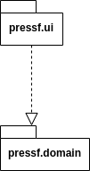

# Arkkitehtuurikuvaus

## Rakenne
Ohjelman rakenne tulee noudattamaan kolmitasoista kerrosarkkitehtuuria(DAO vielä lisää), ja koodin pakkausrakenne on seuraava:

Pakkaus _pressf.ui_ sisältää JavaFX:llä toteutetun käyttöliittymän ja _pressf.domain_ sovelluslogiikan.

### Päätoiminnallisuudet

Kuvataan seuraavaksi sovelluksen toimintalogiikka muutaman päätoiminnallisuuden osalta sekvenssikaaviona.

#### käyttäjän uuden tunnuksen luominen

Kun kirjautumisnäkymässä on syötekenttään kirjoitettu käyttäjätunnus ja klikataan painiketta _createButton_ etenee sovelluksen kontrolli seuraavasti:

## Käyttöliittymä

## Sovelluslogiikka

## Tietojen pysyväistallennus

### Tiedostot

### Päätoiminnallisuudet

#### käyttäjän kirjaantuminen

#### uuden käyttäjän luominen

#### Muut toiminnallisuudet

## Ohjelman rakenteeseen jääneet heikkoudet

### käyttöliittymä

### DAO-luokat
